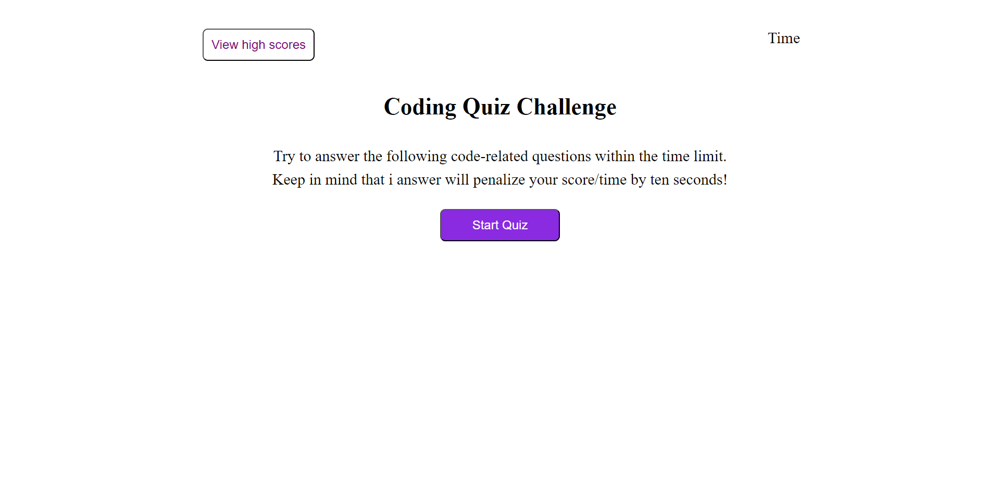
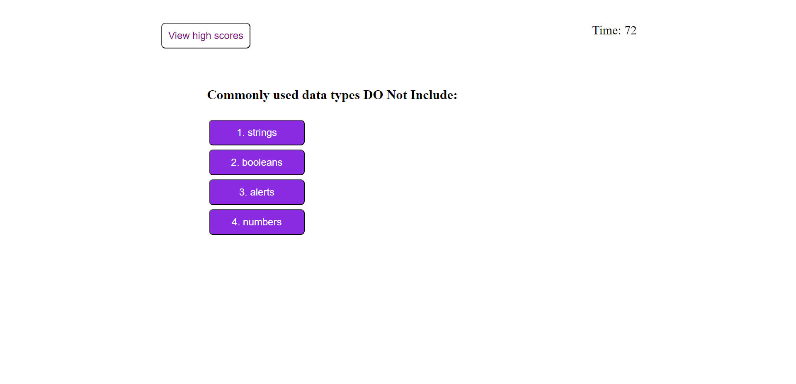
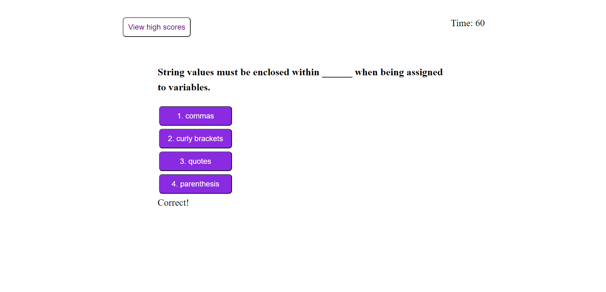
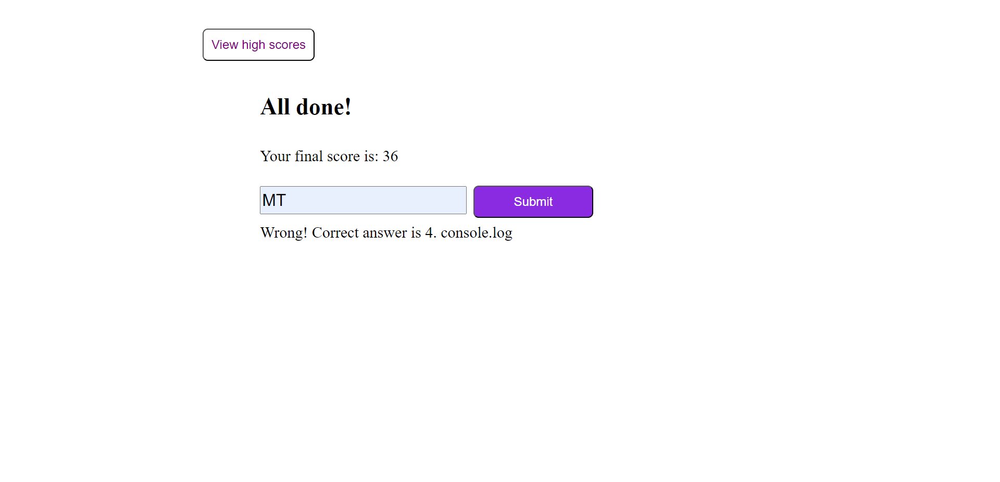
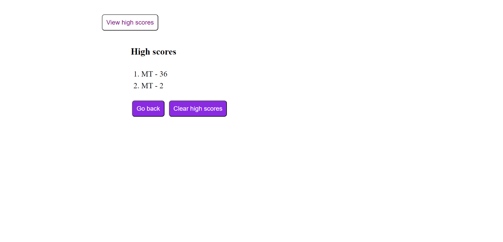

# JavaScript Code Quiz

  ## Description

  This is a timed quiz with multiple-choice questions. Upon completion, you can save your score with your initial, and compare with the highest score record.

  ## Links  

  Page published at https://mtan1230.github.io/javascript-code-quiz/

  ## Usage  
  * Click to start 
    
  * Answer questions within a time limit
    
   
  * Submit your initial and score 
   
  * View your high score
   

